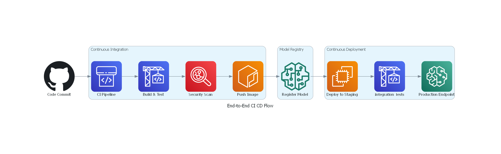
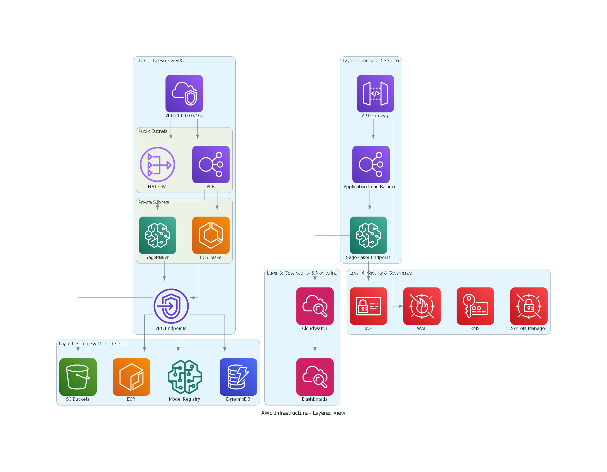
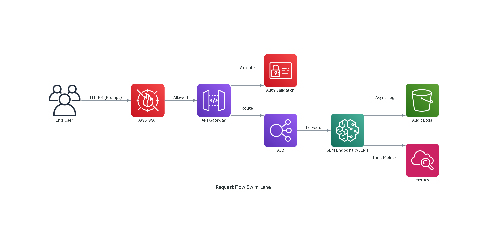

# 1. Layered Architecture Diagrams

> [!NOTE]
> These diagrams provide the **visual blueprint** for the entire SLM deployment. Refer back to them as you read the subsequent artifacts — they map directly to the services and flows described in the PRD, HLD, and LLD.

---

## 1.1 End-to-End Flow: Code Commit → Model Serving

This diagram traces the complete lifecycle of your SLM — from the moment a developer pushes code, through automated testing, model packaging, deployment, and finally serving inference requests to end-users.

### Why This Flow Matters

| Stage | Purpose | What Could Go Wrong Without It |
|-------|---------|-------------------------------|
| **CI Pipeline** | Ensures every code change is tested and scanned before reaching production | Broken or vulnerable code ships to production |
| **Security Scan** | Catches CVEs in container images *before* deployment | Known vulnerabilities exposed to the internet |
| **Model Registry** | Version-controls model artifacts, enabling rollback | No audit trail; can't reproduce past deployments |
| **Canary Analysis** | Validates new model in production with a fraction of traffic | Bad model update degrades service for all users |
| **Blue/Green Deploy** | Zero-downtime switchover between model versions | Downtime during deployments |

---

## 1.2 AWS Infrastructure — Layered View

This diagram organizes every AWS service by its architectural role. Think of these as "floors" in a building — each layer depends on the one below it.

### Layer Responsibilities

| Layer | Services | Why It Exists |
|-------|----------|---------------|
| **Layer 0 — Network** | VPC, Subnets, NAT GW, VPC Endpoints | Isolates your infrastructure from the public internet. Private subnets ensure the model endpoint is never directly exposed. VPC Endpoints avoid data traversing the internet when accessing AWS services. |
| **Layer 1 — Storage** | S3, ECR, Model Registry, DynamoDB | Stores everything — model weights (can be multi-GB), container images, configuration, and metadata. S3 + KMS encryption ensures data at rest is protected. |
| **Layer 2 — Compute** | SageMaker, ECS, ALB, API Gateway, Auto Scaling | This is where inference happens. SageMaker manages GPU instances and scaling. API Gateway provides a managed, throttled front door. |
| **Layer 3 — Observability** | CloudWatch, X-Ray, SNS | You can't fix what you can't see. Tracks latency, GPU utilization, token throughput, error rates, and alerts the team when SLAs breach. |
| **Layer 4 — Security** | IAM, KMS, WAF, Secrets Manager, CloudTrail | Defense in depth. Every layer has its own security controls, but this layer governs *who* can do *what* across the entire stack. |

---

## 1.3 Request Flow — Detailed Swim Lane

This diagram shows exactly what happens when an end-user sends a prompt to your deployed SLM.

> [!TIP]
> Notice how the SLM endpoint sits behind **four layers of protection** (WAF → API Gateway → Auth → ALB) before any request reaches it. This is the "defense-in-depth" pattern — even if one layer is compromised, the others still protect the model.
