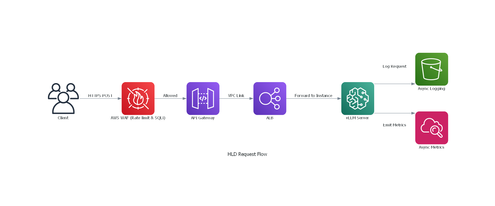
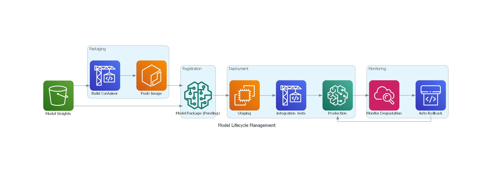
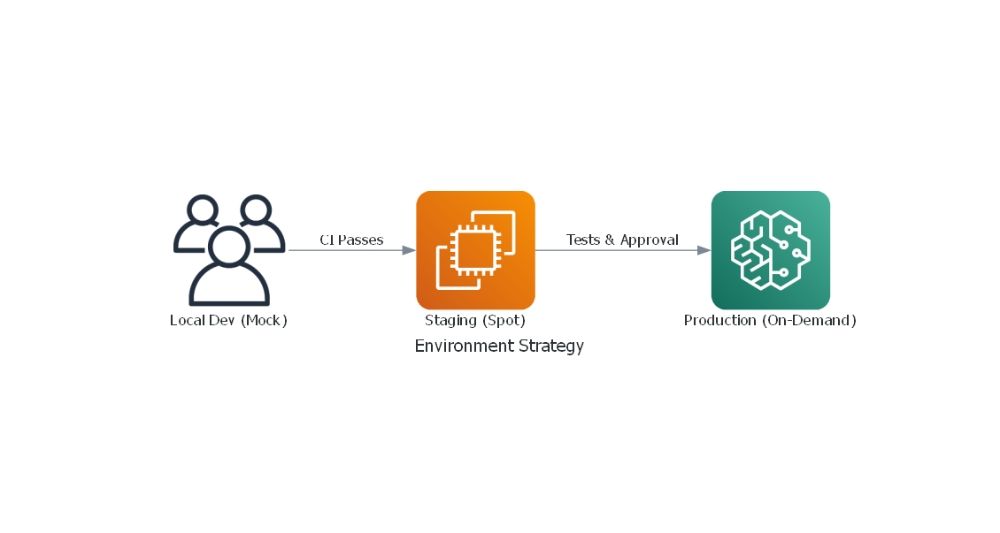

# 3. High-Level Design (HLD)

> [!NOTE]
> This document translates the PRD requirements into **specific AWS services and architectural patterns**. Every service choice below includes a justification tied back to a requirement from the PRD.

---

## 3.1 AWS Services Selection & Justification

### Compute & Serving

| Service | Role | Why This Over Alternatives? |
|---------|------|-----------------------------|
| **Amazon SageMaker Real-Time Endpoints** | Primary inference serving | **vs. Self-managed ECS/EKS:** SageMaker provides managed GPU instance provisioning, built-in auto-scaling, model monitoring, and blue/green deployments out of the box. For a team new to MLOps, this dramatically reduces operational overhead. You don't need to manage Kubernetes clusters or GPU drivers. |
| **ECS Fargate** | Async/batch inference (overflow) | **Why Fargate:** Serverless containers — no EC2 instances to manage. Useful for non-latency-sensitive workloads (batch processing, model evaluation jobs) where you don't need GPU. |
| **vLLM** (on SageMaker) | Inference engine inside the container | **vs. TGI / Triton:** vLLM's PagedAttention algorithm delivers 2-4x higher throughput than naive implementations. It supports continuous batching natively, meaning multiple requests share GPU memory efficiently. For SLMs specifically, this is the best throughput-per-dollar option. (More detail in the LLD.) |

### Networking & API

| Service | Role | Why? |
|---------|------|------|
| **Amazon API Gateway (HTTP API)** | Managed API front door | Handles authentication, rate limiting, throttling, and request validation. HTTP API type (vs. REST API) is chosen for lower latency and lower cost — we don't need REST API's advanced features like request/response transformation. |
| **Application Load Balancer (ALB)** | Layer 7 load balancing | Distributes traffic across multiple SageMaker endpoint instances. Supports health checks, sticky sessions, and path-based routing. |
| **Amazon VPC** | Network isolation | All compute runs inside a VPC with private subnets. The model endpoint is **never** directly reachable from the internet. |
| **VPC Endpoints (PrivateLink)** | Private AWS service access | S3, ECR, SageMaker, and CloudWatch are accessed via VPC Endpoints, meaning traffic never leaves the AWS network backbone. This satisfies NFR-3 (network isolation). |
| **NAT Gateway** | Outbound internet for private subnets | Allows instances in private subnets to pull updates (e.g., pip packages during container build) without being directly accessible from the internet. |

### Storage & Registry

| Service | Role | Why? |
|---------|------|------|
| **Amazon S3** | Model artifact storage, logs, data | The universal storage layer. Model weights (.bin/.safetensors files) are stored here. Server-side encryption with KMS keys satisfies NFR-3. Versioning enabled for rollback capability (FR-3.2). |
| **Amazon ECR** | Container image registry | Stores Docker images for the inference server. Integrated vulnerability scanning catches CVEs before deployment (NFR-3). |
| **SageMaker Model Registry** | Model versioning & approval | Provides a structured workflow for model versions: `PendingApproval` → `Approved` → `Rejected`. This is the single source of truth for "which model version is in production?" (FR-3.1). |
| **Amazon DynamoDB** | Configuration & metadata store | Stores model configuration, feature flags, and deployment metadata. Single-digit millisecond reads ensure no added latency to the inference path. |

### CI/CD

| Service | Role | Why? |
|---------|------|------|
| **AWS CodePipeline** | Pipeline orchestrator | **vs. GitHub Actions / Jenkins:** Native AWS integration means no cross-cloud credential management. CodePipeline has native hooks into ECR, SageMaker, and S3, reducing glue code. |
| **AWS CodeBuild** | Build & test execution | Managed build servers — no Jenkins maintenance. Supports custom Docker images, so you can install any build tooling you need. GPU-capable build instances available for integration tests. |
| **AWS CodeCommit** (or GitHub) | Source repository | If the client requires all infrastructure on AWS, CodeCommit keeps everything in-network. If they prefer GitHub, CodePipeline has a native GitHub source connector. |

### Security

| Service | Role | Requirement Mapped |
|---------|------|--------------------|
| **AWS IAM** | Identity & access control | NFR-3: Least privilege |
| **AWS KMS** | Encryption key management | NFR-3: Encryption at rest |
| **AWS WAF** | Web application firewall | NFR-3: SQL injection, XSS protection, rate limiting |
| **AWS Secrets Manager** | Secrets storage & rotation | NFR-3: No hardcoded credentials |
| **AWS CloudTrail** | API audit logging | NFR-3: Audit logging |
| **Amazon Inspector** | Vulnerability assessment | NFR-3: Vulnerability scanning |

### Observability

| Service | Role | Why? |
|---------|------|------|
| **Amazon CloudWatch** | Metrics, logs, alarms, dashboards | Native integration with every AWS service. Custom metrics for token throughput, GPU utilization. Composite alarms for multi-signal alerting. |
| **AWS X-Ray** | Distributed tracing | Traces a request from API Gateway → ALB → SageMaker Endpoint, showing exactly where latency is introduced at each hop. |
| **Amazon SNS** | Alert notifications | Sends alarm notifications to Slack, email, or PagerDuty. Integrated with CloudWatch alarms. |

---

## 3.2 Data & Request Flow

### Step-by-Step: What Happens When a User Sends a Prompt



### Request Payload Example

```json
// POST https://api.example.com/v1/predict
// Headers: { "x-api-key": "ak_live_xxx", "Content-Type": "application/json" }

{
  "prompt": "Summarize the key findings from the Q4 earnings report.",
  "max_tokens": 256,
  "temperature": 0.7,
  "top_p": 0.9,
  "stop_sequences": ["\n\n"]
}
```

### Response Payload Example

```json
{
  "id": "pred-a1b2c3d4",
  "generated_text": "The Q4 earnings report highlights three key findings: ...",
  "usage": {
    "prompt_tokens": 14,
    "completion_tokens": 187,
    "total_tokens": 201
  },
  "model": "slm-v1.2.0",
  "latency_ms": 214,
  "finish_reason": "stop"
}
```

---

## 3.3 Model Lifecycle Management

This is the heart of MLOps — how the fine-tuned model moves from "someone trained it on their machine" to "it's reliably serving production traffic."



### Model Versioning Strategy

| Concept | Implementation | Example |
|---------|---------------|---------|
| **Semantic Versioning** | `MAJOR.MINOR.PATCH` for model versions | `v1.2.0` → `v1.2.1` (patch fix) |
| **Model Package Group** | SageMaker Model Package Group = one model family | Group: `client-slm-production` |
| **Model Package** | Each version is a Model Package within the group | Package: `client-slm-production/v1.2.1` |
| **Approval Status** | `PendingApproval` → `Approved` or `Rejected` | Only `Approved` models can be deployed to production |
| **Artifact Lineage** | Each package records: S3 URI of weights, ECR URI of container, training metadata | Full traceability from production back to training run |

### What Happens During a Rollback?

1. **Alert fires** — CloudWatch detects P99 latency > 500ms for 5 consecutive minutes
2. **SNS notification** — Team is alerted via Slack/PagerDuty
3. **Auto-rollback triggers** — CloudFormation (or pipeline) redeploys the previous model version
4. **Traffic shifts** — ALB drains connections from the bad endpoint and shifts 100% traffic to the rollback endpoint
5. **Model marked** — The failing version is marked `Rejected` in the Model Registry with the failure reason
6. **Post-mortem** — Team investigates using X-Ray traces and CloudWatch logs

> [!TIP]
> **Why SageMaker Model Registry over just tagging S3 objects?** Model Registry provides a structured approval workflow, automatic lineage tracking, and integrates directly with SageMaker deployment APIs. With S3 alone, you'd need to build all of this custom logic yourself.

---

## 3.4 Environment Strategy

| Environment | Purpose | Instance Type | Auto-Scaling | Cost Control |
|-------------|---------|---------------|--------------|--------------|
| **Development** | Local testing with mock endpoint | CPU only (local Docker) | N/A | Free (local) |
| **Staging** | Pre-production validation | `ml.g5.xlarge` (1x A10G) | Fixed: 1 instance | Spot instances (90% savings) |
| **Production** | Live traffic serving | `ml.g5.xlarge` (1x A10G) | Min: 1, Max: 4, Target: 70% GPU util | On-Demand + Savings Plan |



> [!IMPORTANT]
> **Key Design Decision:** We use **SageMaker Real-Time Endpoints** as the primary serving mechanism rather than self-managed EKS. This trades some flexibility for significantly reduced operational complexity. For a team new to MLOps, managing a Kubernetes cluster with GPU node pools, device plugins, and pod scheduling is a substantial operational burden that SageMaker eliminates entirely.
