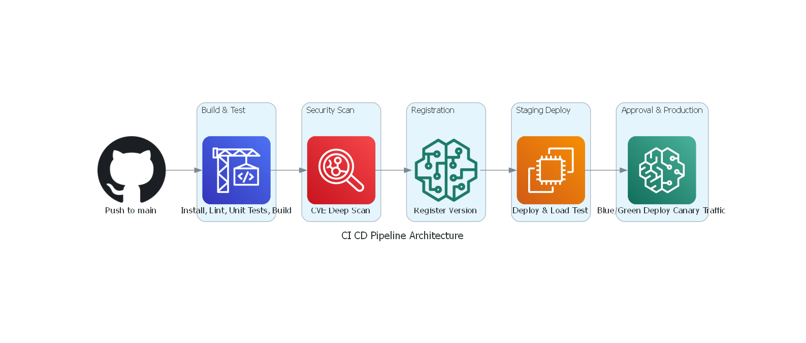
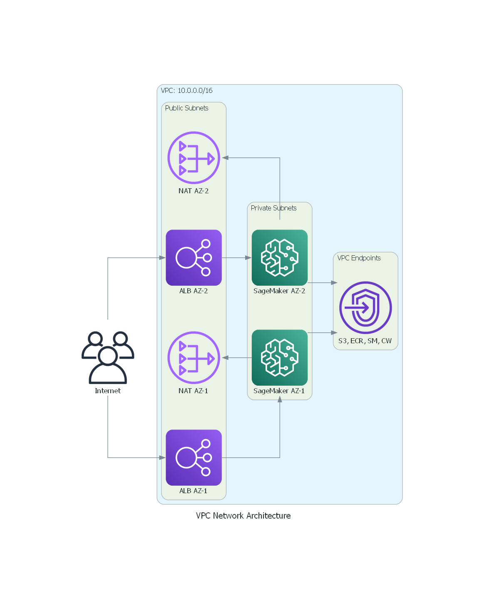

# 4. Low-Level Design (LLD)

> [!NOTE]
> This document is the **engineering blueprint**. It contains the exact configurations, code snippets, and technical decisions that a developer needs to implement the architecture described in the HLD. If the HLD is the "what," the LLD is the "exactly how."

---

## 4.1 CI/CD Pipeline Architecture

### Pipeline Stages (Detailed)



### CodeBuild `buildspec.yml`

```yaml
# buildspec.yml — This is the instruction file that tells CodeBuild
# exactly what commands to run in each phase of the build.
version: 0.2

env:
  secrets-manager:
    DOCKER_HUB_TOKEN: "slm/dockerhub:token"  # Avoids Docker Hub rate limits

phases:
  install:
    runtime-versions:
      python: 3.11
    commands:
      - echo "Installing dependencies..."
      - pip install -r requirements.txt
      - pip install -r requirements-dev.txt  # Test/lint dependencies

  pre_build:
    commands:
      # Linting: Catches code style issues and type errors before they reach production
      - echo "Running linters..."
      - ruff check src/ --output-format=github
      - mypy src/ --strict

      # Unit Tests: Validates business logic without needing GPU or network access
      - echo "Running unit tests..."
      - pytest tests/unit/ -v --cov=src --cov-report=xml --junitxml=test-results.xml

      # Log into ECR (AWS's Docker registry)
      - echo "Logging into ECR..."
      - aws ecr get-login-password --region $AWS_REGION | docker login --username AWS --password-stdin $ECR_REGISTRY

  build:
    commands:
      - echo "Building Docker image..."
      - export IMAGE_TAG=$(git rev-parse --short HEAD)
      - docker build -t $ECR_REGISTRY/$ECR_REPO:$IMAGE_TAG -t $ECR_REGISTRY/$ECR_REPO:latest .
      - docker push $ECR_REGISTRY/$ECR_REPO:$IMAGE_TAG
      - docker push $ECR_REGISTRY/$ECR_REPO:latest

  post_build:
    commands:
      # Upload model artifacts to S3 with versioning
      - echo "Uploading model artifacts to S3..."
      - aws s3 cp model/ s3://$MODEL_BUCKET/models/$IMAGE_TAG/ --recursive

      # Register model in SageMaker Model Registry
      - echo "Registering model version..."
      - python scripts/register_model.py --model-version $IMAGE_TAG --image-uri $ECR_REGISTRY/$ECR_REPO:$IMAGE_TAG

reports:
  pytest-reports:
    files:
      - test-results.xml
    file-format: JUNITXML

artifacts:
  files:
    - deployment/**/*
    - scripts/**/*
```

---

## 4.2 Serving Stack Deep-Dive

### Inference Framework Comparison

| Feature | **vLLM** ⭐ (Recommended) | **TGI** (Hugging Face) | **Triton** (NVIDIA) |
|---------|--------------------------|------------------------|---------------------|
| **Throughput** | Highest (PagedAttention) | High (FlashAttention) | High (custom backends) |
| **Continuous Batching** | ✅ Native | ✅ Native | ✅ With custom config |
| **Streaming** | ✅ SSE support | ✅ SSE support | ⚠️ gRPC streaming only |
| **Quantization** | ✅ AWQ, GPTQ, FP8 | ✅ AWQ, GPTQ | ✅ TensorRT-LLM |
| **SageMaker Integration** | ✅ Custom container | ✅ HF DLC available | ✅ NVIDIA DLC available |
| **Complexity to Operate** | Low | Low | High |
| **Best For** | SLMs with high throughput needs | Quick HuggingFace model deploys | Multi-model, multi-framework |
| **Community & Docs** | Excellent, fast-growing | Excellent (HuggingFace) | Good but enterprise-focused |

> [!TIP]
> **Why vLLM for this project?** Three reasons:
> 1. **PagedAttention** — Manages GPU memory like an OS manages RAM pages, reducing memory waste by up to 90%. For SLMs on a single GPU, this means you can serve more concurrent requests.
> 2. **Continuous Batching** — Instead of waiting for a full batch, vLLM dynamically adds/removes requests from the batch as they arrive/complete. This keeps the GPU busy at all times.
> 3. **Simple API** — OpenAI-compatible API out of the box, so your client's applications can switch from OpenAI to your SLM by just changing the base URL.

### Dockerfile for Inference Container

```dockerfile
# Multi-stage build keeps the final image small and secure
# Stage 1: Build dependencies
FROM python:3.11-slim AS builder

WORKDIR /app
COPY requirements-inference.txt .
RUN pip install --no-cache-dir --prefix=/install -r requirements-inference.txt

# Stage 2: Production image (minimal attack surface)
FROM python:3.11-slim AS production

# Security: Run as non-root user
RUN groupadd -r slm && useradd -r -g slm -d /app -s /sbin/nologin slm

WORKDIR /app

# Copy only the installed packages from builder
COPY --from=builder /install /usr/local
COPY src/ ./src/
COPY configs/ ./configs/

# Health check endpoint for ALB
HEALTHCHECK --interval=30s --timeout=5s --retries=3 \
  CMD curl -f http://localhost:8080/health || exit 1

# Switch to non-root user
USER slm

# vLLM server with OpenAI-compatible API
ENTRYPOINT ["python", "-m", "vllm.entrypoints.openai.api_server"]
CMD ["--model", "/app/model", \
     "--host", "0.0.0.0", \
     "--port", "8080", \
     "--max-model-len", "4096", \
     "--dtype", "auto", \
     "--gpu-memory-utilization", "0.9", \
     "--enable-chunked-prefill"]
```

### `requirements-inference.txt`

```text
vllm==0.8.5
safetensors>=0.4.0
tokenizers>=0.20.0
uvicorn[standard]>=0.30.0
prometheus-client>=0.20.0
```

### Model Loading Configuration

```python
# src/serve.py — Custom model loading and configuration
"""
SLM Inference Server Configuration

This module configures the vLLM engine with settings optimized for
Small Language Models on a single GPU (A10G, 24GB VRAM).
"""

from dataclasses import dataclass
from pathlib import Path
import os


@dataclass
class ModelConfig:
    """Configuration for the SLM inference engine."""

    # Model source — downloaded from S3 during container startup
    model_path: str = os.getenv("MODEL_PATH", "/app/model")

    # GPU settings — tuned for ml.g5.xlarge (single A10G, 24GB VRAM)
    gpu_memory_utilization: float = 0.90  # Reserve 10% for overhead
    max_model_len: int = 4096             # Max context window
    dtype: str = "auto"                   # auto-detect fp16/bf16

    # Batching — vLLM's continuous batching settings
    max_num_batched_tokens: int = 8192    # Max tokens in a single batch
    max_num_seqs: int = 64               # Max concurrent sequences

    # Quantization (optional — reduces VRAM usage by ~50%)
    quantization: str | None = os.getenv("QUANTIZATION", None)  # "awq" or "gptq"

    # Serving
    host: str = "0.0.0.0"
    port: int = 8080

    def validate(self) -> None:
        """Validate that the model path exists and config is sane."""
        model_dir = Path(self.model_path)
        if not model_dir.exists():
            raise FileNotFoundError(
                f"Model not found at {self.model_path}. "
                "Ensure model weights are downloaded from S3 during container init."
            )
        if self.gpu_memory_utilization > 0.95:
            raise ValueError(
                "gpu_memory_utilization > 0.95 risks OOM errors. "
                "Keep it ≤ 0.90 for stability."
            )
```

---

## 4.3 Security Posture (Detailed)

### 4.3.1 VPC Network Architecture



### 4.3.2 Subnet Allocation

| Subnet | CIDR | AZ | Purpose | Internet Access |
|--------|------|----|---------|-----------------|
| `pub-az1` | `10.0.1.0/24` | us-east-1a | NAT Gateway, ALB | Direct (IGW) |
| `pub-az2` | `10.0.2.0/24` | us-east-1b | NAT Gateway, ALB | Direct (IGW) |
| `priv-az1` | `10.0.10.0/24` | us-east-1a | SageMaker, ECS | Outbound only (NAT) |
| `priv-az2` | `10.0.20.0/24` | us-east-1b | SageMaker, ECS | Outbound only (NAT) |
| `vpce` | `10.0.100.0/24` | us-east-1a | VPC Endpoints | None |

> [!IMPORTANT]
> **Why two Availability Zones (AZs)?** If one AZ experiences an outage (rare but possible), the other AZ continues serving traffic. This is how we achieve the 99.9% uptime SLA from the PRD. Always deploy critical infrastructure across at least 2 AZs.

### 4.3.3 Security Groups

| Security Group | Attached To | Inbound Rules | Outbound Rules |
|---------------|-------------|---------------|----------------|
| `sg-alb` | Application Load Balancer | `443/tcp` from `0.0.0.0/0` (HTTPS only) | `8080/tcp` to `sg-sagemaker` |
| `sg-sagemaker` | SageMaker Endpoint instances | `8080/tcp` from `sg-alb` only | `443/tcp` to VPC Endpoints |
| `sg-vpce` | VPC Endpoint ENIs | `443/tcp` from `sg-sagemaker` | N/A (managed by AWS) |
| `sg-codebuild` | CodeBuild projects | None (no inbound needed) | `443/tcp` to `0.0.0.0/0` (for package downloads) |

> [!NOTE]
> **Security Group Principle:** Each group only allows the minimum traffic needed. The SageMaker instances can *only* receive traffic from the ALB (not from the internet directly), and can *only* make outbound calls to VPC Endpoints (not to arbitrary internet hosts).

### 4.3.4 IAM Roles (Least Privilege)

```yaml
# Each service gets its own IAM role with ONLY the permissions it needs.
# This limits the "blast radius" if any single component is compromised.

Roles:
  SageMakerExecutionRole:
    # The role that the SageMaker endpoint assumes to load the model and serve requests
    Trust: sagemaker.amazonaws.com
    Policies:
      - Effect: Allow
        Action:
          - s3:GetObject          # Read model weights from S3
          - s3:ListBucket         # List model versions
        Resource:
          - arn:aws:s3:::slm-model-artifacts-*
          - arn:aws:s3:::slm-model-artifacts-*/*
      - Effect: Allow
        Action:
          - ecr:GetDownloadUrlForLayer  # Pull container image
          - ecr:BatchGetImage
          - ecr:GetAuthorizationToken
        Resource: arn:aws:ecr:*:*:repository/slm-inference
      - Effect: Allow
        Action:
          - logs:CreateLogGroup    # Write inference logs
          - logs:CreateLogStream
          - logs:PutLogEvents
        Resource: arn:aws:logs:*:*:log-group:/aws/sagemaker/*
      - Effect: Allow
        Action:
          - cloudwatch:PutMetricData  # Emit custom metrics
        Resource: "*"
        Condition:
          StringEquals:
            cloudwatch:namespace: "SLM/Inference"
      - Effect: Allow
        Action:
          - kms:Decrypt             # Decrypt model artifacts
        Resource: arn:aws:kms:*:*:key/slm-model-key-id

  CodePipelineRole:
    Trust: codepipeline.amazonaws.com
    Policies:
      - Effect: Allow
        Action:
          - codebuild:StartBuild
          - codebuild:BatchGetBuilds
        Resource: arn:aws:codebuild:*:*:project/slm-*
      - Effect: Allow
        Action:
          - s3:GetObject
          - s3:PutObject
        Resource: arn:aws:s3:::slm-pipeline-artifacts-*/*
      - Effect: Allow
        Action:
          - sagemaker:CreateModel
          - sagemaker:CreateEndpointConfig
          - sagemaker:UpdateEndpoint
          - sagemaker:DescribeEndpoint
        Resource: arn:aws:sagemaker:*:*:*

  CodeBuildRole:
    Trust: codebuild.amazonaws.com
    Policies:
      - Effect: Allow
        Action:
          - ecr:PutImage
          - ecr:InitiateLayerUpload
          - ecr:UploadLayerPart
          - ecr:CompleteLayerUpload
          - ecr:GetAuthorizationToken
        Resource: "*"
      - Effect: Allow
        Action:
          - s3:PutObject
        Resource: arn:aws:s3:::slm-model-artifacts-*/*
      - Effect: Allow
        Action:
          - secretsmanager:GetSecretValue
        Resource: arn:aws:secretsmanager:*:*:secret:slm/*
```

### 4.3.5 WAF Rules Configuration

```yaml
# AWS WAF protects the API Gateway from common web attacks
# Think of it as a bouncer at the door of your API

WAFWebACL:
  Name: slm-api-waf
  DefaultAction: Allow  # Allow by default; block only known-bad patterns
  Rules:
    - Name: RateLimit
      Priority: 1
      Action: Block
      Statement:
        RateBasedStatement:
          Limit: 1000            # Max 1000 requests per 5-minute window per IP
          AggregateKeyType: IP
      # WHY: Prevents a single client from overwhelming the GPU-backed endpoint

    - Name: AWSManagedRulesCommonRuleSet
      Priority: 2
      OverrideAction: None
      Statement:
        ManagedRuleGroupStatement:
          VendorName: AWS
          Name: AWSManagedRulesCommonRuleSet
      # WHY: Blocks SQL injection, XSS, and other OWASP Top 10 attacks

    - Name: AWSManagedRulesKnownBadInputsRuleSet
      Priority: 3
      OverrideAction: None
      Statement:
        ManagedRuleGroupStatement:
          VendorName: AWS
          Name: AWSManagedRulesKnownBadInputsRuleSet
      # WHY: Blocks known-malicious payloads (Log4j, etc.)

    - Name: GeoRestriction
      Priority: 4
      Action: Block
      Statement:
        GeoMatchStatement:
          CountryCodes:
            - CN  # Example: Block specific countries if required by compliance
            - RU
      # WHY: Compliance requirement — adjust based on client's geo-restrictions

    - Name: RequestBodySizeLimit
      Priority: 5
      Action: Block
      Statement:
        SizeConstraintStatement:
          FieldToMatch:
            Body: {}
          ComparisonOperator: GT
          Size: 65536  # 64KB max request body
          TextTransformations:
            - Priority: 0
              Type: NONE
      # WHY: Prevents abuse via oversized prompts that could consume excessive GPU time
```

---

## 4.4 Observability

### 4.4.1 Key Metrics to Track

| Category | Metric | Source | Alarm Threshold | Why It Matters |
|----------|--------|--------|-----------------|----------------|
| **Latency** | `InferenceLatency_P50` | vLLM + CloudWatch | > 200ms | Indicates model or GPU is struggling |
| **Latency** | `InferenceLatency_P99` | vLLM + CloudWatch | > 500ms | Tail latency affects worst-case UX |
| **Throughput** | `TokensPerSecond` | vLLM custom metric | < 30 tokens/s | Model is underperforming |
| **Throughput** | `RequestsPerSecond` | ALB metrics | > 80% of max capacity | Time to scale out |
| **GPU** | `GPUUtilization` | SageMaker built-in | > 85% sustained for 5 min | GPU is saturated; scale out |
| **GPU** | `GPUMemoryUtilization` | SageMaker built-in | > 90% | Risk of OOM; check for memory leaks |
| **Errors** | `5xxErrorRate` | ALB + API Gateway | > 1% | Something is broken |
| **Errors** | `ModelLatencyAlarm` | SageMaker | Invocation errors > 5/min | Model container is crashing |
| **Availability** | `HealthyHostCount` | ALB Target Group | < 2 | Below HA threshold |
| **Cost** | `EstimatedCharges` | CloudWatch Billing | > $X/day | Cost spike detection |

### 4.4.2 Custom Metrics Emission (Python)

```python
# src/metrics.py — Custom CloudWatch metrics for SLM-specific KPIs
"""
Emits custom metrics to CloudWatch that aren't available out-of-the-box.
These metrics give you visibility into the MODEL's behavior, not just the infrastructure.
"""

import time
import boto3
from functools import wraps
from typing import Callable, Any

cloudwatch = boto3.client("cloudwatch")
NAMESPACE = "SLM/Inference"  # All custom metrics live under this namespace


def emit_inference_metrics(
    prompt_tokens: int,
    completion_tokens: int,
    latency_ms: float,
    model_version: str,
) -> None:
    """
    Emit inference metrics to CloudWatch after each prediction.

    Why custom metrics? SageMaker gives you invocation count and latency,
    but NOT token-level metrics. For LLM/SLM serving, tokens/second is
    the most important throughput metric because it directly correlates
    with GPU efficiency and user-perceived speed.
    """
    cloudwatch.put_metric_data(
        Namespace=NAMESPACE,
        MetricData=[
            {
                "MetricName": "PromptTokens",
                "Value": prompt_tokens,
                "Unit": "Count",
                "Dimensions": [
                    {"Name": "ModelVersion", "Value": model_version},
                    {"Name": "Environment", "Value": "production"},
                ],
            },
            {
                "MetricName": "CompletionTokens",
                "Value": completion_tokens,
                "Unit": "Count",
                "Dimensions": [
                    {"Name": "ModelVersion", "Value": model_version},
                    {"Name": "Environment", "Value": "production"},
                ],
            },
            {
                "MetricName": "InferenceLatencyMs",
                "Value": latency_ms,
                "Unit": "Milliseconds",
                "Dimensions": [
                    {"Name": "ModelVersion", "Value": model_version},
                ],
            },
            {
                "MetricName": "TokensPerSecond",
                "Value": (completion_tokens / (latency_ms / 1000)) if latency_ms > 0 else 0,
                "Unit": "Count/Second",
                "Dimensions": [
                    {"Name": "ModelVersion", "Value": model_version},
                ],
            },
        ],
    )


def track_latency(func: Callable) -> Callable:
    """Decorator to automatically track function execution latency."""
    @wraps(func)
    def wrapper(*args: Any, **kwargs: Any) -> Any:
        start = time.perf_counter()
        result = func(*args, **kwargs)
        elapsed_ms = (time.perf_counter() - start) * 1000
        cloudwatch.put_metric_data(
            Namespace=NAMESPACE,
            MetricData=[{
                "MetricName": f"{func.__name__}_latency_ms",
                "Value": elapsed_ms,
                "Unit": "Milliseconds",
            }],
        )
        return result
    return wrapper
```

### 4.4.3 CloudWatch Dashboard Definition

```json
{
  "dashboardName": "SLM-Production-Dashboard",
  "dashboardBody": {
    "widgets": [
      {
        "type": "metric",
        "properties": {
          "title": "🚀 Inference Latency (P50 / P99)",
          "metrics": [
            ["SLM/Inference", "InferenceLatencyMs", { "stat": "p50", "label": "P50" }],
            ["SLM/Inference", "InferenceLatencyMs", { "stat": "p99", "label": "P99" }]
          ],
          "period": 60,
          "view": "timeSeries"
        }
      },
      {
        "type": "metric",
        "properties": {
          "title": "⚡ Tokens Per Second",
          "metrics": [
            ["SLM/Inference", "TokensPerSecond", { "stat": "Average" }]
          ],
          "period": 60,
          "view": "timeSeries"
        }
      },
      {
        "type": "metric",
        "properties": {
          "title": "🖥️ GPU Utilization (%)",
          "metrics": [
            ["/aws/sagemaker/Endpoints", "GPUUtilization", "EndpointName", "slm-prod"]
          ],
          "period": 60,
          "view": "timeSeries"
        }
      },
      {
        "type": "metric",
        "properties": {
          "title": "❌ Error Rate (5xx)",
          "metrics": [
            ["AWS/ApplicationELB", "HTTPCode_Target_5XX_Count", "LoadBalancer", "slm-alb"]
          ],
          "period": 60,
          "view": "timeSeries"
        }
      },
      {
        "type": "metric",
        "properties": {
          "title": "📊 Request Count",
          "metrics": [
            ["AWS/ApiGateway", "Count", "ApiName", "slm-api"]
          ],
          "period": 60,
          "view": "timeSeries"
        }
      },
      {
        "type": "metric",
        "properties": {
          "title": "💰 Estimated Daily Cost",
          "metrics": [
            ["AWS/Billing", "EstimatedCharges", "Currency", "USD"]
          ],
          "period": 86400,
          "view": "singleValue"
        }
      }
    ]
  }
}
```

### 4.4.4 Alarm Configuration

```yaml
# CloudWatch Alarms — These automatically trigger when metrics breach thresholds
# Think of alarms as your automated on-call engineer that never sleeps

Alarms:
  - Name: SLM-HighLatency-P99
    Description: P99 inference latency exceeds 500ms for 5 consecutive minutes
    Metric: InferenceLatencyMs
    Namespace: SLM/Inference
    Statistic: p99
    Period: 60          # Check every 60 seconds
    EvaluationPeriods: 5  # Must breach for 5 consecutive periods
    Threshold: 500
    ComparisonOperator: GreaterThanThreshold
    AlarmActions:
      - arn:aws:sns:us-east-1:ACCOUNT:slm-alerts  # Sends to Slack/PagerDuty
    # RESPONSE: Investigate GPU utilization. If > 85%, scale out.

  - Name: SLM-HighErrorRate
    Description: 5xx error rate exceeds 1% for 3 consecutive minutes
    Metric: HTTPCode_Target_5XX_Count
    Namespace: AWS/ApplicationELB
    Statistic: Sum
    Period: 60
    EvaluationPeriods: 3
    Threshold: 10  # More than 10 errors per minute
    ComparisonOperator: GreaterThanThreshold
    AlarmActions:
      - arn:aws:sns:us-east-1:ACCOUNT:slm-alerts-critical
    # RESPONSE: Check container logs. If OOM, increase instance size or reduce batch size.

  - Name: SLM-GPUSaturation
    Description: GPU utilization above 85% for 10 minutes (scale-out signal)
    Metric: GPUUtilization
    Namespace: /aws/sagemaker/Endpoints
    Statistic: Average
    Period: 60
    EvaluationPeriods: 10
    Threshold: 85
    ComparisonOperator: GreaterThanThreshold
    AlarmActions:
      - arn:aws:sns:us-east-1:ACCOUNT:slm-alerts
    # RESPONSE: Auto-scaling should handle this. If not, check scaling policy config.

  - Name: SLM-LowHealthyHosts
    Description: Fewer than 2 healthy hosts in the ALB target group
    Metric: HealthyHostCount
    Namespace: AWS/ApplicationELB
    Statistic: Minimum
    Period: 60
    EvaluationPeriods: 2
    Threshold: 2
    ComparisonOperator: LessThanThreshold
    AlarmActions:
      - arn:aws:sns:us-east-1:ACCOUNT:slm-alerts-critical
    # RESPONSE: Check if instances are failing health checks. Review container logs.
```

---

## 4.5 Auto-Scaling Configuration

```yaml
# SageMaker Endpoint Auto-Scaling Policy
# This automatically adds/removes GPU instances based on demand

AutoScalingPolicy:
  EndpointName: slm-production
  VariantName: AllTraffic
  MinCapacity: 1        # Always have at least 1 instance running
  MaxCapacity: 4        # Never exceed 4 instances (cost control)

  TargetTrackingScalingPolicy:
    TargetValue: 70.0   # Target 70% GPU utilization
    CustomizedMetricSpecification:
      MetricName: GPUUtilization
      Namespace: /aws/sagemaker/Endpoints
      Statistic: Average
    ScaleInCooldown: 300   # Wait 5 min before scaling IN (avoid flapping)
    ScaleOutCooldown: 60   # Scale OUT quickly (1 min) to handle traffic spikes

  # WHY 70% target?
  # - Below 70%: GPU has headroom for burst traffic
  # - Above 70%: Latency starts increasing non-linearly
  # - At 90%+: Risk of request queuing and timeout errors
```

---

## 4.6 Terraform Module Structure

```
infrastructure/
├── main.tf                    # Root module — orchestrates all child modules
├── variables.tf               # Input variables (region, instance types, etc.)
├── outputs.tf                 # Exported values (endpoint URL, API key, etc.)
├── providers.tf               # AWS provider configuration
├── backend.tf                 # S3 remote state configuration
├── environments/
│   ├── staging.tfvars         # Staging-specific variable values
│   └── production.tfvars      # Production-specific variable values
└── modules/
    ├── vpc/                   # VPC, subnets, NAT gateways, VPC endpoints
    │   ├── main.tf
    │   ├── variables.tf
    │   └── outputs.tf
    ├── security/              # IAM roles, KMS keys, Security Groups, WAF
    │   ├── main.tf
    │   ├── iam.tf
    │   ├── kms.tf
    │   ├── waf.tf
    │   └── variables.tf
    ├── storage/               # S3 buckets, ECR repository, DynamoDB tables
    │   ├── main.tf
    │   ├── variables.tf
    │   └── outputs.tf
    ├── compute/               # SageMaker endpoint, ECS cluster, ALB
    │   ├── main.tf
    │   ├── sagemaker.tf
    │   ├── alb.tf
    │   ├── variables.tf
    │   └── outputs.tf
    ├── api/                   # API Gateway, usage plans, API keys
    │   ├── main.tf
    │   ├── variables.tf
    │   └── outputs.tf
    ├── cicd/                  # CodePipeline, CodeBuild projects
    │   ├── main.tf
    │   ├── pipeline.tf
    │   ├── buildspec.yml
    │   ├── variables.tf
    │   └── outputs.tf
    └── observability/         # CloudWatch dashboards, alarms, SNS topics
        ├── main.tf
        ├── dashboards.tf
        ├── alarms.tf
        ├── variables.tf
        └── outputs.tf
```

> [!TIP]
> **Why modular Terraform?** Each module can be developed, tested, and deployed independently. If you need to update a WAF rule, you don't risk accidentally modifying the VPC. This also enables different team members to work on different modules in parallel without merge conflicts.
