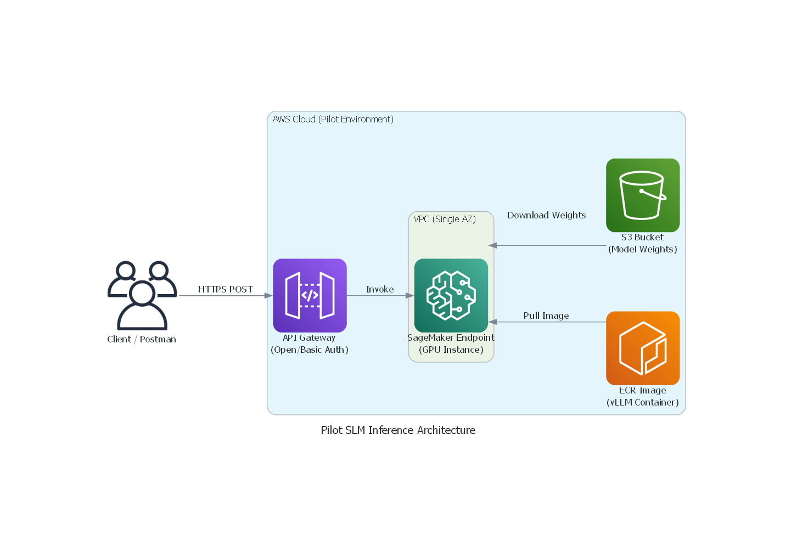

# Pilot SLM Inference Plan

> **Status:** Internal Planning Document  
> **Objective:** Prove the core end-to-end functionality of serving an SLM on AWS for a rapid client demonstration, before investing time in the full enterprise-scale architecture.

---

## 🎯 Purpose of the Pilot

The full enterprise architecture (with CI/CD pipelines, multi-AZ networking, WAF, blue/green deployments, etc.) is highly robust but takes time to provision. 

**This Pilot is designed to:**
1. **Prove the Core Tech:** Demonstrate that `vLLM` can successfully serve our custom model weights on an AWS GPU instance.
2. **Validate Latency:** Get baseline metrics for token-generation latency.
3. **Showcase the Integration:** Allow the client to hit a real AWS API Gateway endpoint from Postman or their own application.
4. **Secure Buy-In:** Serve as a tangible milestone to secure approval to build out the rest of the MLSecOps landscape.

---

## ⚖️ Scope & Landscape

To achieve a rapid deployment (within a 3-week pilot sprint rather than a multi-month rollout), we will strip back the enterprise layers and focus strictly on the inference path.

### What is IN Scope (The Pilot):
- Manual creation of a single Amazon SageMaker Real-Time Endpoint (GPU instance selected based on the model's VRAM and parameter requirements).
- Manual upload of a basic `vLLM` Docker image to ECR.
- Manual upload of model weights (`.safetensors`) to an S3 bucket.
- A simple API Gateway (HTTP API) directly invoking the SageMaker endpoint.
- Basic API Key authentication.

### What is OUT of Scope (Saved for Phase 2):
- ❌ **CI/CD Automation:** No CodePipeline or CodeBuild. We will run Docker builds locally.
- ❌ **Advanced Security:** No WAF, no strict private subnets, no IAM granular least-privilege (we will use managed policies for speed).
- ❌ **Load Balancing:** No Application Load Balancer (ALB) or Auto Scaling Groups.
- ❌ **Observability:** No custom CloudWatch dashboards or alarms.

---

## 🏗️ Pilot Architecture

Notice how simplified this architecture is compared to the final enterprise version. It represents the absolute minimum viable path from a user request to a GPU calculation.

---

## 🏃 Execution Plan (3-Week Sprint)

### Phase 1: Requirements & Local Setup (Week 1)
- **Goal:** Establish the technical foundation and procure necessary AWS credentials.
- **Action:** Finalize exact model version and quantization format. Ensure local development environments are authenticated against the target AWS account.

### Phase 2: Local Container Validation (Week 1)
- **Goal:** Prove the container works locally before dealing with AWS.
- **Action:** Write the `vLLM` Dockerfile. Run the container locally using a dummy model (e.g., a tiny HuggingFace model) to ensure the server starts and successfully responds to HTTP inference requests.

### Phase 3: Cloud Storage & Registry Provisioning (Week 2)
- **Goal:** Prepare the AWS environment to hold our artifacts.
- **Action:** 
  1. Create a secure S3 bucket and upload the real custom SLM weights.
  2. Create an Amazon ECR repository and push our validated local Docker image.

### Phase 4: SageMaker Deployment & Tuning (Week 2)
- **Goal:** Get the model running and responding in the cloud.
- **Action:** 
  1. Navigate to the AWS Console → SageMaker → Create Model (using the ECR image and S3 data).
  2. Create an Endpoint Configuration targeting the optimal GPU instance.
  3. Deploy the Endpoint and run internal connectivity and latency tests.

### Phase 5: The Front Door API (Week 3)
- **Goal:** Expose the endpoint securely so the client can query it.
- **Action:**
  1. Create a simple API Gateway integration (HTTP API) targeting the SageMaker Endpoint.
  2. Generate a secure API Key and Usage Plan for the client.

### Phase 6: Client Demonstration & Handoff (Week 3)
- **Goal:** Prove success to stakeholders and establish next steps.
- **Action:** Provide the client with the API Endpoint URL and the API Key. Run a live demonstration showing the input prompt and the generated response, highlighting the Time to First Token (TTFT). Discuss the transition to the full Enterprise Architecture.

---

## ✅ Success Criteria for the Pilot
- [ ] Endpoint successfully responds with a `200 OK` and valid JSON payload.
- [ ] Time to First Token (TTFT) is under 500ms.
- [ ] Client can successfully authenticate via API Key.
- [ ] Model accurately reflects the fine-tuned behavior (not just the base model).
